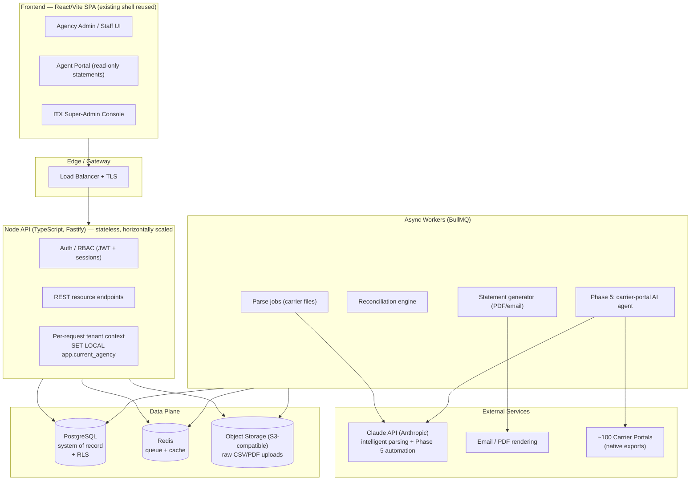
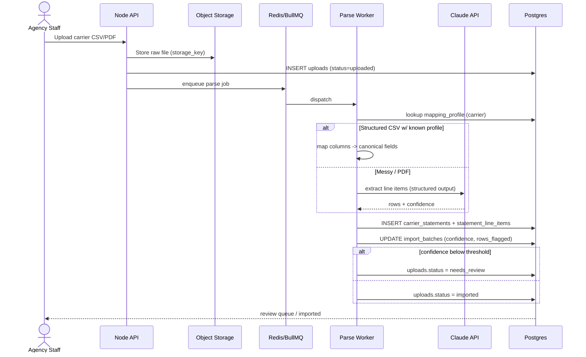
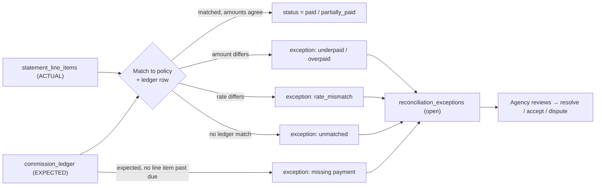
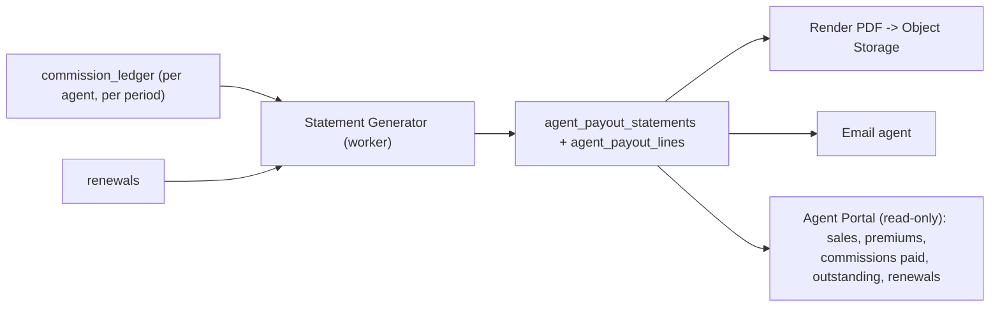

# Inspire CRM — Technical Architecture Blueprint

> ITX's branded commission-reconciliation platform for transit insurance agencies.
> Status: design blueprint. Backend = custom Node + Postgres. Tenancy = shared DB with
> Row-Level Security keyed on `agency_id`.

---

## 1. Vision & Problem

**Inspire CRM** is ITX's branded SaaS for **transit insurance agencies** — from small/mid-market
firms up to nationals. Two clients are already live on the predecessor platform ("Ana"), generating
roughly **$5M** and **$50M** in revenue respectively.

### The core problem

Transit agencies operate on a painful commission float:

- Agencies **front commissions to agents for ~30 days**, then wait **another ~15 days** for the
  carrier payment to settle. That's a 45-day cash-flow gap the agency absorbs.
- Agents **receive no commission statements**, so they can't see what they've earned, what's been
  paid, or what's outstanding. This breeds **mistrust** between agent and agency.
- **Carriers pay inconsistently.** Some pay the full commission **upfront on the first sale** while
  the **agency retains the renewals**; others spread commission across the policy term.
- **Commission percentages aren't always clear until the payment actually arrives** — the agency
  often can't confirm the exact rate until the carrier statement lands.

### What agencies and agents need

- **Agencies:** real-time visibility into **commission owed vs. commission paid**, per carrier, per
  agent, per policy — plus discrepancy flagging when a carrier underpays or misreports.
- **Agents:** **transparent monthly statements** showing sales, premiums, commissions paid,
  outstanding amounts, and renewal tracking.

### Market & positioning

- **Target:** transit insurance agencies, small → national.
- **Competitors:** general agency-management platforms at ~**$1,200 per seat / year**.
- **Differentiator:** *not price* — it's **purpose-built commission workflows** plus the
  **transparency that eliminates agent mistrust**. No competitor solves the front-and-reconcile
  problem natively.

### Explicit non-goals

- **No integrations with quoting platforms** (TurboRater, EZLynx, etc.). Agencies won't pay for yet
  another system to bolt on. Inspire is the commission layer, not a rater.
- **No carrier API integrations as a prerequisite.** We support **~100 carriers** by ingesting their
  **native export formats** (CSV/PDF from carrier portals). Carrier portal automation arrives later
  as a premium feature (Phase 5), not as a dependency.

---

## 2. System Architecture

The existing repo is a monolithic React/Vite SPA (`src/App.jsx`) with **no backend** — CRM data is
ephemeral `useState`, and only client accounts persist (in plaintext) in `localStorage`. There is
already a usable multi-tenant *shell*: a login screen, admin-vs-client roles, and per-client module
permissions (`AVAILABLE_MODULES`, `opencrm_clients`). The blueprint below defines the real backend.



### Component responsibilities

| Component | Tech | Responsibility |
|---|---|---|
| **Frontend** | React 18 + Vite (existing) | Agency console, agent portal, ITX super-admin. Reuses the existing module shell + permission model; swaps `localStorage` mock data for API calls. |
| **API** | Node + TypeScript, **Fastify** | Stateless REST API. Authn/authz, validation, sets per-request tenant context for RLS, enqueues jobs. |
| **Database** | **PostgreSQL 16** | Single source of truth. Shared DB, `agency_id` on every tenant table, RLS-enforced isolation. |
| **Object storage** | S3-compatible (e.g. AWS S3 / R2) | Raw carrier uploads (CSV/PDF), generated statement PDFs. DB stores only references + metadata. |
| **Queue / cache** | **Redis + BullMQ** | Async parse/reconcile/statement/portal jobs; hot-path caching (dashboards, lookups). |
| **Parsing service** | Worker + per-carrier mapping profiles + **Claude API** | Normalizes ~100 carrier formats. Structured CSVs via mapping profiles; messy/PDF statements via Claude extraction with confidence scoring + human review. |
| **Statement generator** | Worker + PDF renderer + email | Builds monthly agent payout statements, renders PDF, emails + posts to agent portal. |
| **Auth** | JWT access tokens + rotating refresh sessions | RBAC across four roles (below). Replaces the current plaintext-localStorage credential scheme. |

### Deployment topology

All four pieces deploy to **one platform — Railway** — as a single project: the API container, the
static SPA, managed Postgres, and managed Redis. This consolidates hosting/billing while keeping the
API a **persistent container** (not serverless). Config-as-code lives in `server/railway.json`,
`server/Dockerfile`, `Dockerfile.web`, and `Caddyfile`; see
[DEPLOY-RAILWAY.md](DEPLOY-RAILWAY.md).

| Layer | Railway service | Why |
|---|---|---|
| **Frontend SPA** | **web** — `Dockerfile.web` (Caddy serves the Vite build) | Static assets with SPA fallback + immutable asset caching. Reaches the API via build-time `VITE_API_URL`. |
| **API + workers** | **api** — `server/Dockerfile`, scaled horizontally | Persistent process: pooled DB connections, RLS transactions, and long-running/bursty batch jobs (parsing, statement runs, Phase 5 portal bots) that do **not** fit serverless time limits. Workers run as extra services off the same image. |
| **Database** | **Postgres** (managed) + PgBouncer/pooling | Bounded, pooled connections; read replicas + partitioning as tenants scale to national volume (see §9). |
| **Queue / cache** | **Redis** (managed) | BullMQ job queue + hot-path cache. |

> **Why one platform but still a container (not serverless)?** A commission engine needs persistent
> pooled DB access and heavy batch/worker workloads. Fully-serverless (Netlify/Vercel Functions)
> hits connection storms, function execution-time limits on parse/statement jobs, and cold-start
> latency on the hot path — and you'd run a container for the workers anyway. Railway gives the SPA,
> the container API, Postgres, and Redis from one project. The exact same code/images run on
> Render / Fly.io / AWS if you ever migrate — only the dashboard wiring differs. (Netlify remains a
> drop-in alternative for the SPA alone via `netlify.toml`.)

---

## 3. Multi-Tenancy & Security

### Isolation model — shared DB + RLS

- **One Postgres database.** Every tenant-scoped table carries `agency_id uuid NOT NULL`.
- **Row-Level Security** policies enforce isolation in the database, not just the application — a
  query can only ever see its own agency's rows even if the app has a bug.
- On each authenticated request, the API opens a transaction and runs
  `SET LOCAL app.current_agency = '<agency_id>'`; RLS policies compare against this setting.
- The connection pool uses a low-privilege role that is **subject to RLS**; migrations/maintenance
  use a separate role that may `BYPASSRLS`.

```sql
-- Session helper read by every policy
CREATE FUNCTION app.current_agency() RETURNS uuid
  LANGUAGE sql STABLE AS $$ SELECT current_setting('app.current_agency', true)::uuid $$;
```

### Roles (RBAC)

| Role | Scope | Can do |
|---|---|---|
| **ITX super-admin** | Cross-tenant (platform) | Provision agencies, manage carrier mapping-profile library, billing/tiers, support. Uses a privileged path, audited. |
| **Agency admin** | One agency | Manage agents, carriers/appointments, commission rules, uploads, reconciliation, statements, billing. |
| **Agency staff** | One agency | Day-to-day: uploads, review parse results, work reconciliation exceptions. Configurable. |
| **Agent** | Self, within one agency | **Read-only** access to their own statements, premiums, paid/outstanding, renewals. |

### Security baseline

- **Encryption:** TLS in transit; encryption at rest for DB and object storage. Server-side
  envelope encryption for sensitive columns (agent tax IDs / bank details for Phase 4 payouts).
- **PII / financial data:** agents' tax IDs and (later) banking details are restricted columns with
  field-level encryption and stricter RLS; never returned to the agent portal in full.
- **Audit log:** append-only `audit_log` capturing who/what/when for every mutating action and every
  cross-tenant super-admin access.
- **Uploads:** virus/malware scan on ingest, content-type allow-list (CSV/XLSX/PDF), size limits,
  signed time-limited URLs for download.
- **Migration note:** the current `opencrm_clients` plaintext-in-`localStorage` credential scheme is
  replaced entirely by server-side auth with hashed passwords (argon2) and short-lived tokens.

---

## 4. Database Schema

Illustrative DDL (Postgres). Every tenant table has `agency_id` + RLS. Timestamps and soft-delete
omitted for brevity except where meaningful. UUID primary keys throughout.

### Enums

```sql
CREATE TYPE user_role        AS ENUM ('itx_admin','agency_admin','agency_staff','agent');
CREATE TYPE upload_status    AS ENUM ('uploaded','scanning','parsing','parsed','needs_review','failed','imported');
CREATE TYPE ledger_status    AS ENUM ('expected','partially_paid','paid','overpaid','written_off');
CREATE TYPE exception_status AS ENUM ('open','investigating','resolved','accepted','disputed');
CREATE TYPE commission_basis AS ENUM ('upfront_first_term','level_each_term','renewal_only','split');
CREATE TYPE payout_status    AS ENUM ('draft','issued','paid');
```

### Core tenancy & identity

```sql
-- Tenant root
CREATE TABLE agencies (
  id            uuid PRIMARY KEY DEFAULT gen_random_uuid(),
  name          text NOT NULL,
  legal_name    text,
  tier          text NOT NULL DEFAULT 'base',   -- 'base' | 'premium'
  status        text NOT NULL DEFAULT 'active',  -- 'active' | 'suspended'
  settings      jsonb NOT NULL DEFAULT '{}',
  created_at    timestamptz NOT NULL DEFAULT now()
);

-- All human logins (agency staff/admins, agents, ITX admins)
CREATE TABLE users (
  id            uuid PRIMARY KEY DEFAULT gen_random_uuid(),
  agency_id     uuid REFERENCES agencies(id),    -- NULL only for itx_admin
  email         citext UNIQUE NOT NULL,
  password_hash text NOT NULL,                    -- argon2
  role          user_role NOT NULL,
  agent_id      uuid,                             -- set when role = 'agent'
  status        text NOT NULL DEFAULT 'active',
  created_at    timestamptz NOT NULL DEFAULT now()
);
CREATE INDEX ON users (agency_id);
```

### Producers, carriers & rules

```sql
-- The producing agents whose commissions we track
CREATE TABLE agents (
  id            uuid PRIMARY KEY DEFAULT gen_random_uuid(),
  agency_id     uuid NOT NULL REFERENCES agencies(id),
  display_name  text NOT NULL,
  email         citext,
  tax_id_enc    bytea,                            -- field-encrypted PII
  default_split numeric(6,4),                     -- agent's share of agency commission
  status        text NOT NULL DEFAULT 'active',
  created_at    timestamptz NOT NULL DEFAULT now()
);
CREATE INDEX ON agents (agency_id);

-- Global carrier registry (shared reference; not tenant-scoped)
CREATE TABLE carriers (
  id            uuid PRIMARY KEY DEFAULT gen_random_uuid(),
  name          text NOT NULL,
  naic_code     text,
  created_at    timestamptz NOT NULL DEFAULT now()
);

-- An agency's appointment/relationship with a carrier
CREATE TABLE agency_carrier_appointments (
  id            uuid PRIMARY KEY DEFAULT gen_random_uuid(),
  agency_id     uuid NOT NULL REFERENCES agencies(id),
  carrier_id    uuid NOT NULL REFERENCES carriers(id),
  carrier_code  text,                             -- agency's producer code at the carrier
  active        boolean NOT NULL DEFAULT true,
  UNIQUE (agency_id, carrier_id)
);

-- How a carrier pays commission (drives EXPECTED commission)
CREATE TABLE commission_rules (
  id            uuid PRIMARY KEY DEFAULT gen_random_uuid(),
  agency_id     uuid NOT NULL REFERENCES agencies(id),
  carrier_id    uuid NOT NULL REFERENCES carriers(id),
  product_line  text,                             -- e.g. 'auto_liability', 'cargo'
  basis         commission_basis NOT NULL,
  first_term_pct numeric(6,4),                    -- upfront % on first sale
  renewal_pct   numeric(6,4),                     -- renewal %, may be agency-retained
  agency_retains_renewal boolean NOT NULL DEFAULT false,
  tiers         jsonb,                            -- volume tiers / overrides
  effective_from date,
  effective_to   date
);
CREATE INDEX ON commission_rules (agency_id, carrier_id, product_line);
```

### Policies & premiums

```sql
CREATE TABLE policies (
  id            uuid PRIMARY KEY DEFAULT gen_random_uuid(),
  agency_id     uuid NOT NULL REFERENCES agencies(id),
  carrier_id    uuid NOT NULL REFERENCES carriers(id),
  agent_id      uuid REFERENCES agents(id),
  policy_number text NOT NULL,
  insured_name  text,
  product_line  text,
  effective_date date,
  term_months   int,
  is_renewal    boolean NOT NULL DEFAULT false,
  prior_policy_id uuid REFERENCES policies(id),   -- links renewal chain
  status        text NOT NULL DEFAULT 'active',
  UNIQUE (agency_id, carrier_id, policy_number)
);
CREATE INDEX ON policies (agency_id, agent_id);

-- Premium charges/changes over the policy life (drives commission base)
CREATE TABLE premium_transactions (
  id            uuid PRIMARY KEY DEFAULT gen_random_uuid(),
  agency_id     uuid NOT NULL REFERENCES agencies(id),
  policy_id     uuid NOT NULL REFERENCES policies(id),
  txn_type      text NOT NULL,                    -- 'new','endorsement','renewal','cancel'
  premium_amount numeric(14,2) NOT NULL,
  txn_date      date NOT NULL
);
CREATE INDEX ON premium_transactions (agency_id, policy_id);
```

### Ingestion (Phase 1)

```sql
-- Raw file landed from a carrier portal
CREATE TABLE uploads (
  id            uuid PRIMARY KEY DEFAULT gen_random_uuid(),
  agency_id     uuid NOT NULL REFERENCES agencies(id),
  carrier_id    uuid REFERENCES carriers(id),
  uploaded_by   uuid REFERENCES users(id),
  storage_key   text NOT NULL,                    -- object-storage reference
  file_name     text NOT NULL,
  mime_type     text,
  byte_size     bigint,
  status        upload_status NOT NULL DEFAULT 'uploaded',
  created_at    timestamptz NOT NULL DEFAULT now()
);
CREATE INDEX ON uploads (agency_id, status);

-- One parse run over an upload, using a mapping profile
CREATE TABLE import_batches (
  id            uuid PRIMARY KEY DEFAULT gen_random_uuid(),
  agency_id     uuid NOT NULL REFERENCES agencies(id),
  upload_id     uuid NOT NULL REFERENCES uploads(id),
  mapping_profile_id uuid,                         -- which carrier template was used
  parser        text,                             -- 'profile' | 'claude' | 'hybrid'
  confidence    numeric(5,4),
  rows_total    int,
  rows_flagged  int,
  status        upload_status NOT NULL,
  created_at    timestamptz NOT NULL DEFAULT now()
);

-- Reusable per-carrier column/field mapping (library curated by ITX, overridable per agency)
CREATE TABLE mapping_profiles (
  id            uuid PRIMARY KEY DEFAULT gen_random_uuid(),
  carrier_id    uuid NOT NULL REFERENCES carriers(id),
  agency_id     uuid,                             -- NULL = global default profile
  name          text NOT NULL,
  format        text NOT NULL,                    -- 'csv' | 'xlsx' | 'pdf'
  field_map     jsonb NOT NULL,                   -- source column -> canonical field
  version       int NOT NULL DEFAULT 1
);
```

### Carrier statements & the commission ledger (Phases 1–2)

```sql
-- A normalized carrier commission statement (header)
CREATE TABLE carrier_statements (
  id            uuid PRIMARY KEY DEFAULT gen_random_uuid(),
  agency_id     uuid NOT NULL REFERENCES agencies(id),
  carrier_id    uuid NOT NULL REFERENCES carriers(id),
  import_batch_id uuid REFERENCES import_batches(id),
  statement_date date,
  period_start  date,
  period_end    date,
  total_amount  numeric(14,2),
  created_at    timestamptz NOT NULL DEFAULT now()
);
CREATE INDEX ON carrier_statements (agency_id, carrier_id, statement_date);

-- ACTUAL commission lines parsed from the carrier statement
CREATE TABLE statement_line_items (
  id            uuid PRIMARY KEY DEFAULT gen_random_uuid(),
  agency_id     uuid NOT NULL REFERENCES agencies(id),
  statement_id  uuid NOT NULL REFERENCES carrier_statements(id),
  policy_id     uuid REFERENCES policies(id),     -- matched during reconciliation
  policy_number_raw text,                          -- as printed, pre-match
  premium_amount numeric(14,2),
  commission_amount numeric(14,2) NOT NULL,
  commission_pct numeric(6,4),                     -- as reported (often unknown until now)
  is_renewal    boolean,
  raw           jsonb                              -- original parsed row for audit
);
CREATE INDEX ON statement_line_items (agency_id, statement_id);
CREATE INDEX ON statement_line_items (agency_id, policy_id);

-- The heart of the system: EXPECTED vs PAID per policy/commission event
CREATE TABLE commission_ledger (
  id            uuid PRIMARY KEY DEFAULT gen_random_uuid(),
  agency_id     uuid NOT NULL REFERENCES agencies(id),
  policy_id     uuid NOT NULL REFERENCES policies(id),
  agent_id      uuid REFERENCES agents(id),
  carrier_id    uuid NOT NULL REFERENCES carriers(id),
  premium_basis numeric(14,2),
  expected_amount numeric(14,2) NOT NULL,          -- from commission_rules
  paid_amount   numeric(14,2) NOT NULL DEFAULT 0,  -- summed from matched line items
  agent_advance_amount numeric(14,2) NOT NULL DEFAULT 0, -- what agency fronted
  status        ledger_status NOT NULL DEFAULT 'expected',
  expected_date date,                              -- ~45-day settlement projection
  matched_line_item_id uuid REFERENCES statement_line_items(id),
  created_at    timestamptz NOT NULL DEFAULT now()
);
CREATE INDEX ON commission_ledger (agency_id, status);
CREATE INDEX ON commission_ledger (agency_id, agent_id);

-- Discrepancies flagged by the reconciliation engine
CREATE TABLE reconciliation_exceptions (
  id            uuid PRIMARY KEY DEFAULT gen_random_uuid(),
  agency_id     uuid NOT NULL REFERENCES agencies(id),
  ledger_id     uuid REFERENCES commission_ledger(id),
  line_item_id  uuid REFERENCES statement_line_items(id),
  kind          text NOT NULL,        -- 'underpaid','overpaid','rate_mismatch','unmatched','missing'
  expected      numeric(14,2),
  actual        numeric(14,2),
  delta         numeric(14,2),
  status        exception_status NOT NULL DEFAULT 'open',
  note          text,
  created_at    timestamptz NOT NULL DEFAULT now()
);
CREATE INDEX ON reconciliation_exceptions (agency_id, status);
```

### Agent statements (Phase 3) & renewals

```sql
-- Monthly statement issued TO an agent (header)
CREATE TABLE agent_payout_statements (
  id            uuid PRIMARY KEY DEFAULT gen_random_uuid(),
  agency_id     uuid NOT NULL REFERENCES agencies(id),
  agent_id      uuid NOT NULL REFERENCES agents(id),
  period_start  date NOT NULL,
  period_end    date NOT NULL,
  total_premium numeric(14,2),
  total_paid    numeric(14,2),
  total_outstanding numeric(14,2),
  pdf_storage_key text,
  status        payout_status NOT NULL DEFAULT 'draft',
  issued_at     timestamptz,
  UNIQUE (agency_id, agent_id, period_start, period_end)
);

-- Line detail behind an agent statement (drawn from commission_ledger)
CREATE TABLE agent_payout_lines (
  id            uuid PRIMARY KEY DEFAULT gen_random_uuid(),
  agency_id     uuid NOT NULL REFERENCES agencies(id),
  statement_id  uuid NOT NULL REFERENCES agent_payout_statements(id),
  ledger_id     uuid NOT NULL REFERENCES commission_ledger(id),
  policy_number text,
  premium_amount numeric(14,2),
  commission_paid numeric(14,2),
  commission_outstanding numeric(14,2),
  is_renewal    boolean
);
CREATE INDEX ON agent_payout_lines (agency_id, statement_id);

-- Renewal tracking (which policies are due, retained vs agent-shared)
CREATE TABLE renewals (
  id            uuid PRIMARY KEY DEFAULT gen_random_uuid(),
  agency_id     uuid NOT NULL REFERENCES agencies(id),
  policy_id     uuid NOT NULL REFERENCES policies(id),
  due_date      date NOT NULL,
  expected_premium numeric(14,2),
  agency_retains boolean NOT NULL DEFAULT false,
  status        text NOT NULL DEFAULT 'upcoming'  -- 'upcoming','renewed','lapsed'
);
CREATE INDEX ON renewals (agency_id, due_date);
```

### Premium-tier tables (Phase 4) & audit

```sql
-- Commission reserve: agency sets aside against fronted advances
CREATE TABLE commission_reserves (
  id            uuid PRIMARY KEY DEFAULT gen_random_uuid(),
  agency_id     uuid NOT NULL REFERENCES agencies(id),
  agent_id      uuid REFERENCES agents(id),
  reserve_pct   numeric(6,4),
  balance       numeric(14,2) NOT NULL DEFAULT 0,
  updated_at    timestamptz NOT NULL DEFAULT now()
);

-- Factoring advance: third-party/agency advances cash against expected commission
CREATE TABLE factoring_advances (
  id            uuid PRIMARY KEY DEFAULT gen_random_uuid(),
  agency_id     uuid NOT NULL REFERENCES agencies(id),
  ledger_id     uuid NOT NULL REFERENCES commission_ledger(id),
  advance_amount numeric(14,2) NOT NULL,
  fee_amount    numeric(14,2) NOT NULL,
  advanced_on   date NOT NULL,
  repaid_on     date,
  status        text NOT NULL DEFAULT 'outstanding'
);

-- Append-only audit trail
CREATE TABLE audit_log (
  id            bigserial PRIMARY KEY,
  agency_id     uuid,
  actor_user_id uuid,
  action        text NOT NULL,
  entity        text NOT NULL,
  entity_id     uuid,
  diff          jsonb,
  at            timestamptz NOT NULL DEFAULT now()
);
CREATE INDEX ON audit_log (agency_id, at);
```

### Sample RLS policies

```sql
-- Enable + force RLS on tenant tables (repeat per table)
ALTER TABLE commission_ledger ENABLE ROW LEVEL SECURITY;
ALTER TABLE commission_ledger FORCE ROW LEVEL SECURITY;

-- 1) Tenant isolation: rows must match the request's agency
CREATE POLICY tenant_isolation ON commission_ledger
  USING (agency_id = app.current_agency());

-- 2) Agents can read only their own ledger rows (read-only portal)
CREATE POLICY agent_self_read ON commission_ledger
  FOR SELECT
  USING (
    agency_id = app.current_agency()
    AND (
      current_setting('app.role', true) <> 'agent'
      OR agent_id = current_setting('app.agent_id', true)::uuid
    )
  );

-- 3) Uploads: only agency staff/admin may insert
CREATE POLICY staff_write_uploads ON uploads
  FOR INSERT
  WITH CHECK (
    agency_id = app.current_agency()
    AND current_setting('app.role', true) IN ('agency_admin','agency_staff')
  );
```

---

## 5. Commission Domain Model

The system reconciles two numbers for every commission event:

1. **Expected commission** — computed when a policy/premium is recorded, using the applicable
   `commission_rules` row (basis + `first_term_pct` / `renewal_pct` × `premium_basis`). This is what
   the carrier *should* pay.
2. **Paid commission** — derived by matching parsed `statement_line_items` to a `commission_ledger`
   row when the carrier statement arrives.

**The float.** When an agency advances commission to an agent, that amount lands in
`commission_ledger.agent_advance_amount`, and `expected_date` projects the ~45-day settlement
(≈30 days agent float + ≈15 days carrier settlement). Dashboards surface "owed vs. paid" by summing
`expected_amount − paid_amount` across open ledger rows, and "exposure" by summing
`agent_advance_amount` not yet covered by `paid_amount`.

**Carrier variability.** `commission_basis` captures the differing carrier behaviors:

- `upfront_first_term` + `agency_retains_renewal = true` → the carrier pays full commission on the
  first sale and the **agency keeps renewals** (no agent share on renewal); renewals still tracked in
  `renewals` for visibility.
- `level_each_term` → commission recurs each term; ledger rows are generated per renewal.
- `split` → first-term and renewal percentages differ; both captured on the rule.

**Unknown rate until payment.** Because the exact percentage is often unconfirmed until the carrier
pays, `commission_ledger.expected_amount` is a *projection*. When `statement_line_items.commission_pct`
arrives and differs from the rule, the reconciliation engine writes a `rate_mismatch` exception rather
than silently trusting either side — the agency reviews and either accepts (updating the rule) or
disputes.

**Reconciliation outcome** updates `commission_ledger.status`: `paid`, `partially_paid`, `overpaid`,
or stays `expected`; mismatches and unmatched lines spawn `reconciliation_exceptions`.

---

## 6. Data Flow Diagrams

### Phase 1 — Ingest & normalize



### Phase 2 — Reconcile



### Phase 3 — Agent statements



---

## 7. Five-Phase Roadmap & Tier Separation

| Phase | Capability | Key tables | Tier |
|---|---|---|---|
| **P1** | Manual CSV/PDF upload from carrier portals + intelligent parsing (mapping profiles + Claude, confidence + review) | `uploads`, `import_batches`, `mapping_profiles`, `carrier_statements`, `statement_line_items` | **Base** |
| **P2** | Automated reconciliation + discrepancy flagging (expected vs paid, rate/amount/unmatched/missing) | `commission_ledger`, `reconciliation_exceptions` | **Base** |
| **P3** | Automated agent commission statements — sales, premiums, commissions paid, outstanding, renewal tracking; PDF + email + agent portal | `agent_payout_statements`, `agent_payout_lines`, `renewals` | **Base** |
| **P4** | Commission **reserve** & **factoring** for cash-flow relief on the 45-day float | `commission_reserves`, `factoring_advances` | **Premium** |
| **P5** | **AI agent automation** — pull commission statements directly from carrier portals monthly (no manual upload) | reuses P1 tables; `PortalBot` worker + Claude | **Premium** |

**Tiering rationale.** Base (P1–P3) delivers the core promise — transparency that eliminates agent
mistrust and real-time owed-vs-paid. Premium (P4–P5) monetizes higher-value outcomes: cash-flow
relief and full hands-off automation. This separates a defensible base offering from upsells without
competing on the ~$1,200/seat price point.

---

## 8. Carrier-Format Strategy (~100 carriers, no integrations)

- **Mapping-profile registry.** `mapping_profiles` holds a canonical field map per carrier/format,
  curated centrally by ITX (global default, `agency_id IS NULL`) and overridable per agency. A new
  carrier export becomes supported by adding/adjusting a profile — no code deploy.
- **Two-track parsing.** Structured CSV/XLSX with a known profile → deterministic column mapping.
  Messy spreadsheets or PDF statements → **Claude** extraction into the canonical schema with
  structured output.
- **Confidence + human-in-the-loop.** Every batch gets a confidence score (`import_batches.confidence`);
  below threshold or with flagged rows, the upload goes to `needs_review` and staff confirm/correct
  before import. Corrections feed profile improvements.
- **Profile reuse & versioning.** Profiles are versioned and shared across agencies appointed with the
  same carrier, so the network effect of supporting one agency's carrier benefits all — the moat
  behind "we handle 100 carriers."

---

## 9. Scalability ($5M → $50M → nationals)

- **Stateless API + horizontal scale.** API and workers are stateless; scale out behind the load
  balancer. Workers scale independently per queue (parse vs reconcile vs statement vs portal).
- **Connection pooling.** PgBouncer (transaction pooling) in front of Postgres so thousands of API/worker
  connections collapse onto a bounded server pool — RLS context is set per transaction, compatible
  with transaction pooling.
- **Indexing.** Every hot query is `agency_id`-leading (composite indexes shown above) so RLS predicates
  and tenant filters share the same index — keeps RLS cheap.
- **Partitioning.** The high-volume tables — `statement_line_items`, `commission_ledger`, `audit_log` —
  partition by `agency_id` (hash) and/or period (range) as a national agency's monthly volume grows,
  keeping indexes small and enabling cheap archival of closed periods.
- **Read replicas.** Dashboards/reporting and the agent portal read from replicas; writes and
  reconciliation hit primary.
- **Caching.** Redis caches dashboard aggregates (owed vs paid, exposure) and carrier/profile lookups;
  invalidated on reconciliation completion.
- **Archival/retention.** Closed statement periods move to cold partitions; raw upload blobs in object
  storage transition to lower-cost tiers after a retention window.
- **Tenant-size tiers.** Most agencies are small and share the pool comfortably; a $50M national gets
  isolated worker concurrency limits and, if needed, dedicated partitions and replica routing — all
  without leaving the shared-DB + RLS model.

---

## 10. Migration Path from the Current SPA

The existing React app (`src/App.jsx`) becomes the frontend with minimal disruption:

1. **Keep the shell.** Reuse the login screen, admin-vs-client role split, and per-module permission
   model (`AVAILABLE_MODULES`) — these map directly onto the four RBAC roles and the agent portal.
2. **Replace storage.** Swap `localStorage`/`useState` mock data for a typed API data layer
   (fetch + React Query or equivalent). `opencrm_clients` plaintext credentials are retired in favor
   of server-side auth (argon2 + tokens).
3. **Add the commission modules.** New screens — Uploads/Import, Reconciliation, Agent Statements,
   Carriers & Rules — slot into the existing module/navigation pattern; the agent portal is a
   read-only subset.
4. **Incremental cutover.** Stand up the API + Postgres, migrate the two existing clients off "Ana"
   agency-by-agency, validating reconciliation against known historical statements before go-live.

---

*End of blueprint.*
