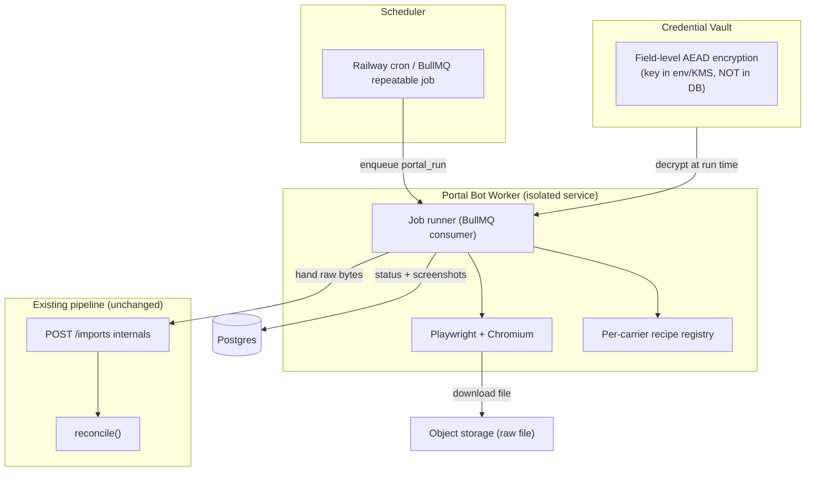

# Phase 5 — Carrier Portal Bot: Technical Scope

**Status:** Scoping only — not yet built. This document defines what it would take to build
Slice 7, the premium-tier automation that logs into carrier portals, downloads commission
statements, and feeds them into the existing Phase 1 ingest pipeline.

**Tier:** Premium (upsell, alongside Reserves & Factoring).

---

## 1. Goal

Eliminate the last manual step. Today an agency admin downloads a CSV/PDF from each carrier
portal and uploads it (Phase 1). Phase 5 does that automatically on a schedule: a headless
browser logs in as the agency, navigates to the commissions/statements area, downloads the
newest statement, and hands the raw file to the **existing `POST /imports` pipeline** —
which already parses, maps, matches policies, reconciles, and flags exceptions.

The bot is a **front-end to the ingest pipeline we already have.** It produces an `uploads`
row + raw file; everything downstream is unchanged.

```
Scheduler → portal_run job → Playwright session → download file
   → reuse parse/normalize → carrier_statements + statement_line_items
   → reconcile() → reconciliation_exceptions  (all existing)
```

---

## 2. Why this is the hardest slice

| Challenge | Detail |
|---|---|
| **No two portals are alike** | ~100 carriers, each a bespoke web app. Every one needs its own navigation recipe. This does not generalize the way CSV parsing does. |
| **Anti-bot defenses** | CAPTCHAs, device fingerprinting, rate limiting, "unrecognized device" email challenges. |
| **MFA / 2FA** | Many carrier portals require TOTP or SMS codes. Full automation requires storing TOTP secrets or a human-in-the-loop relay. |
| **Credential custody** | We hold agencies' carrier portal logins. This is a high-value breach target and a serious liability. |
| **Terms of Service** | Some carrier portals prohibit automated access. Per-carrier legal review required before enabling. |
| **Brittleness** | Portals redesign without notice; recipes silently break. Needs monitoring + alerting + fast recipe updates. |
| **Compute** | Headless Chromium is heavy (RAM/CPU) and bursty — needs isolation from the API process. |

This is why it's explicitly **last** and **premium**: high ongoing maintenance cost, real legal
surface, and it only pays off for agencies with many carriers and high volume.

---

## 3. Architecture

A **separate worker service** (own Railway service, off a new `Dockerfile.bot` with Chromium
baked in). It never shares a process with the API — different scaling, different blast radius.



**Recipe model.** Each carrier gets a declarative recipe (login URL, selectors, navigation
steps, download trigger, file-ready signal). Recipes are versioned and stored as data, not code,
so updating a broken portal is a config change — not a redeploy. Claude can assist in *authoring*
recipes (give it the portal's DOM, ask for selectors) but the run itself is deterministic
Playwright for reliability and auditability.

---

## 4. Data model additions

New migration `0002_portal_bot.sql` (additive; existing tables untouched):

```sql
-- Encrypted carrier portal credentials, one per agency+carrier appointment.
CREATE TABLE portal_credentials (
  id              uuid PRIMARY KEY DEFAULT gen_random_uuid(),
  agency_id       uuid NOT NULL REFERENCES agencies(id),
  carrier_id      uuid NOT NULL REFERENCES carriers(id),
  username_enc    bytea NOT NULL,      -- AEAD ciphertext
  password_enc    bytea NOT NULL,
  totp_secret_enc bytea,               -- nullable; present if portal uses TOTP
  enc_key_id      text NOT NULL,       -- which master key encrypted this (rotation)
  login_url       text,
  status          text NOT NULL DEFAULT 'active',  -- active | needs_attention | disabled
  last_ok_at      timestamptz,
  UNIQUE (agency_id, carrier_id)
);

-- Declarative, versioned navigation recipe per carrier (global, ITX-curated).
CREATE TABLE portal_recipes (
  id          uuid PRIMARY KEY DEFAULT gen_random_uuid(),
  carrier_id  uuid NOT NULL REFERENCES carriers(id),
  version     int NOT NULL DEFAULT 1,
  steps       jsonb NOT NULL,          -- [{action,selector,value,waitFor}, ...]
  active      boolean NOT NULL DEFAULT true,
  created_at  timestamptz NOT NULL DEFAULT now()
);

-- Schedule: when to pull each agency+carrier.
CREATE TABLE portal_schedules (
  id          uuid PRIMARY KEY DEFAULT gen_random_uuid(),
  agency_id   uuid NOT NULL REFERENCES agencies(id),
  carrier_id  uuid NOT NULL REFERENCES carriers(id),
  cron        text NOT NULL,           -- e.g. '0 6 1 * *' monthly
  enabled     boolean NOT NULL DEFAULT true,
  next_run_at timestamptz
);

-- Audit + observability for every run.
CREATE TABLE portal_runs (
  id            uuid PRIMARY KEY DEFAULT gen_random_uuid(),
  agency_id     uuid NOT NULL REFERENCES agencies(id),
  carrier_id    uuid NOT NULL REFERENCES carriers(id),
  schedule_id   uuid REFERENCES portal_schedules(id),
  status        text NOT NULL,         -- queued|running|downloaded|imported|failed|needs_mfa
  upload_id     uuid REFERENCES uploads(id),
  import_batch_id uuid REFERENCES import_batches(id),
  error         text,
  screenshot_key text,                 -- failure screenshot in object storage
  started_at    timestamptz,
  finished_at   timestamptz
);
```

All four get the standard `agency_id` RLS policy except `portal_recipes` (global, ITX-curated,
read-only to agencies — same pattern as `carriers` / global `mapping_profiles`).

---

## 5. Security design (non-negotiable)

1. **Encryption.** Credentials encrypted with AEAD (libsodium `crypto_secretbox` or AES-256-GCM).
   Master key lives in env/Railway secret (later a KMS), **never in Postgres**. DB only stores
   ciphertext, so a DB dump is useless without the key. `enc_key_id` enables key rotation.
2. **Decrypt only in the bot worker, only at run time**, in memory, never logged. Plaintext never
   crosses to the API or the frontend.
3. **Write-only from the UI.** Agencies can set/replace credentials but never read them back
   (mirrors how PII tax IDs are handled in the architecture doc). API returns only
   `{ status, last_ok_at }`, never the secret.
4. **Per-agency isolation.** A run only ever loads one agency's credentials. RLS enforces it.
5. **Audit everything.** Every run logged in `portal_runs`; failures capture a screenshot to
   object storage for debugging without re-running.
6. **Legal gate.** Per-carrier `automation_allowed` flag (default false). A carrier's recipe
   can't be enabled until ITX confirms its ToS permits automated access.

---

## 6. MFA strategy (the crux)

Three tiers, ship in order:

- **Tier A — No-MFA portals.** Fully automated. Ship first. Covers the portals that allow it.
- **Tier B — TOTP portals.** Agency stores the TOTP seed once (encrypted); bot generates the code
  at run time. Fully automated but requires the agency to extract the seed during setup.
- **Tier C — SMS/email/push challenge.** Cannot be fully automated. Falls back to a
  **human-in-the-loop relay**: bot pauses at the challenge, notifies the agency admin (email/SMS),
  admin forwards the code via a one-time link, bot resumes. Run status `needs_mfa`.

Don't promise "100% hands-off for all carriers." Promise "hands-off for the portals that permit
it, assisted for the rest."

---

## 7. UI additions

- **Carriers module** → per-appointment "Enable Automation" panel: enter credentials (write-only),
  pick schedule, see `last_ok_at` + last run status.
- **New "Automation" admin module:** run history table (`portal_runs`), status badges, failure
  screenshots, "Run now" button, MFA-relay inbox for Tier C.
- **ITX super-admin:** recipe authoring/versioning console + per-carrier `automation_allowed` toggle.

---

## 8. Delivery phases (incremental, each shippable)

| Step | Scope | Est. |
|---|---|---|
| 5.0 | Migration + credential vault (encrypt/decrypt lib, write-only API, UI to store creds) | 1 wk |
| 5.1 | Bot worker service skeleton: `Dockerfile.bot` (Chromium), BullMQ consumer, `portal_runs` logging, **manual "Run now"** for 1 pilot no-MFA carrier (Tier A), hand-off to `/imports` internals | 1.5 wk |
| 5.2 | Recipe engine: declarative steps in `portal_recipes`, ITX recipe console, 3–5 carriers | 1.5 wk |
| 5.3 | Scheduler: `portal_schedules` + Railway cron / BullMQ repeatable jobs, monitoring/alerting on failures | 1 wk |
| 5.4 | TOTP (Tier B) support | 0.5 wk |
| 5.5 | Human-in-the-loop MFA relay (Tier C) | 1.5 wk |
| 5.6 | Hardening: retries/backoff, anti-bot mitigations, screenshot capture, per-carrier ToS gating | 1 wk |

**Rough total: ~8–9 engineer-weeks** to a solid v1 covering a meaningful subset of carriers —
then **ongoing maintenance** as the dominant cost (recipes break and need fixing forever).

---

## 9. Refactor needed first

`POST /imports` currently parses from `csvText` in the request body. Before the bot can reuse it,
extract the core into an internal function:

```ts
async function ingestRawFile(c, { agencyId, carrierId, uploadId, rawBytes, mimeType }): Promise<BatchResult>
```

The HTTP route becomes a thin wrapper over it, and the bot calls the same function directly. This
is a small, safe refactor (~half a day) and is a prerequisite for 5.1. It also positions Phase 1
to move to the async BullMQ worker model the architecture already describes.

---

## 10. Recommendation

**Don't build this until there's pull from a paying premium customer with enough carriers to
justify it.** The economics: the manual upload (Phase 1) takes an agency a few minutes per carrier
per month. Automating it is only worth ~8 weeks of build + perpetual recipe maintenance for
agencies running many carriers at high volume — exactly the national-scale tier.

**Suggested sequencing:** deploy what's built (Slices 1–6) to Railway, get the two existing
clients live on the manual pipeline, and let real usage decide whether Phase 5 (or async workers,
S3, XLSX, email delivery) is the highest-value next investment. The credential-vault step (5.0) is
the safest place to start if a customer commits, because it's reusable and carries the security
design that everything else depends on.
